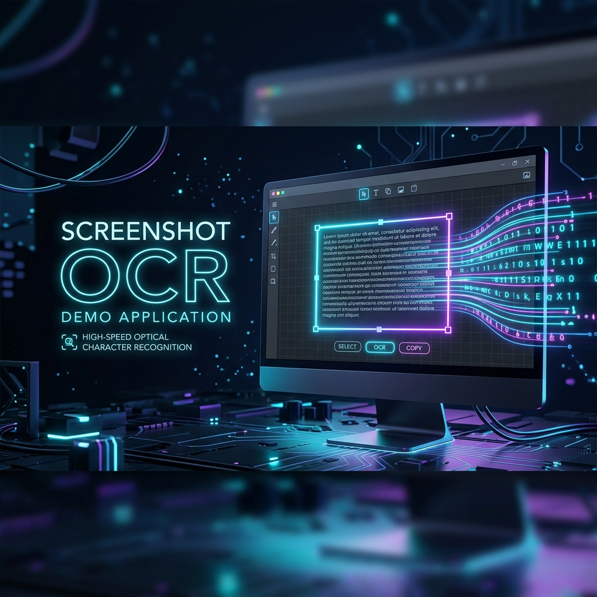

# Screenshot OCR Demo

<p align="center">
  
</p>

基于 Electron + FastAPI + RapidOCR 的离线桌面截图 OCR 工具，支持 PP-OCRv3、PP-OCRv4 与自定义 ONNX 模型。

[English](README_EN.md) | 简体中文

## 🎯 功能特点

### v1.1.0 新增功能
- ✨ **OCR 模型选择面板** - 在设置中快速切换 PP-OCRv3 和 PP-OCRv4
- 🎨 **齿轮图标设置菜单** - 右上角打开 OCR 设置
- 🔄 **动态模型加载** - 无需重启应用即可切换模型
- 📁 **自定义模型支持** - 支持加载自己的 ONNX 格式模型文件
- 💾 **配置持久化** - 用户偏好自动保存到 AppData

### 核心功能
- 🖼️ 快速截图和 OCR 识别
- 📋 识别结果自动复制到剪贴板
- 🌐 支持多种语言（中文、英文等）
- ⚡ 高性能识别引擎

### 技术栈
- 后端：Python FastAPI + RapidOCR（PP-OCRv3/v4）
- 前端：React 19.2.4 + Ant Design 6.3.5
- 桌面：Electron
- 测试：pytest（15 个测试，93% 覆盖率）

## 🚀 快速开始

### 下载和安装
1. 从 [Releases](https://github.com/QiJi11/screenshot-ocr-demo/releases) 下载最新版本
2. Windows：双击 `.exe` 文件安装
3. 安装完成后，应用会自动启动

### 使用
1. 按快捷键或点击托盘图标启动截图
2. 拖选要识别的区域
3. OCR 结果自动复制到剪贴板
4. 点击右上角 `⚙` 打开设置，选择 OCR 模型版本

### 模型选择
- **PP-OCRv3**：速度快，适合实时识别
- **PP-OCRv4**：精度高，适合精度要求高的场景
- **自定义模型**：使用自己的 ONNX 模型文件

## 🛠️ 本地开发

### 前端开发
```powershell
Set-Location D:\AtoC\Projects\screenshot-ocr-demo\frontend
npm install
npm run dev
```

### 后端开发
```powershell
Set-Location D:\AtoC\Projects\screenshot-ocr-demo\backend
python -m venv .venv
.venv\Scripts\python.exe -m pip install -r requirements.txt
.venv\Scripts\python.exe main.py
```

### 构建发布
```powershell
Set-Location D:\AtoC\Projects\screenshot-ocr-demo\frontend
npm run build

Set-Location D:\AtoC\Projects\screenshot-ocr-demo\electron
npx electron-builder
```

Electron 安装包与压缩包会输出到 `electron/dist/` 目录。

## 📡 API

本征后端服务默认监听 `127.0.0.1:8000`。

- `GET /health`：健康检查
- `POST /ocr/recognize`：执行 OCR 识别
- `POST /captures/process`：处理截图任务
- `GET /api/settings/ocr-config`：获取当前 OCR 配置
- `POST /api/settings/ocr-config`：更新 OCR 配置
- `GET /api/settings/available-models`：列出可用 OCR 模型

## 📝 版本历史

| 版本 | 发布日期 | 特点 |
|------|---------|------|
| 1.1.0 | 2026-04-23 | 模型选择面板、设置菜单、配置持久化 |
| 1.0.0 | 2026-03-31 | 初始版本，基础 OCR 功能 |